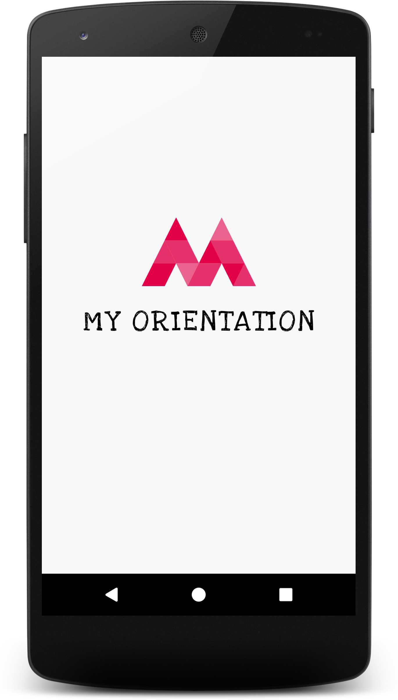
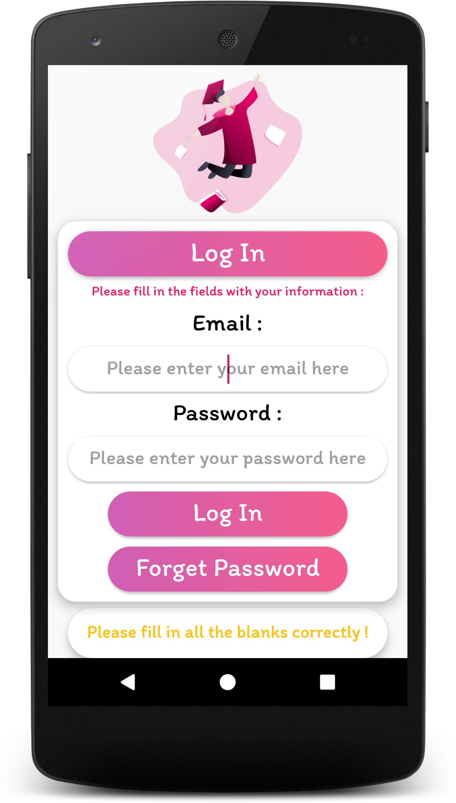
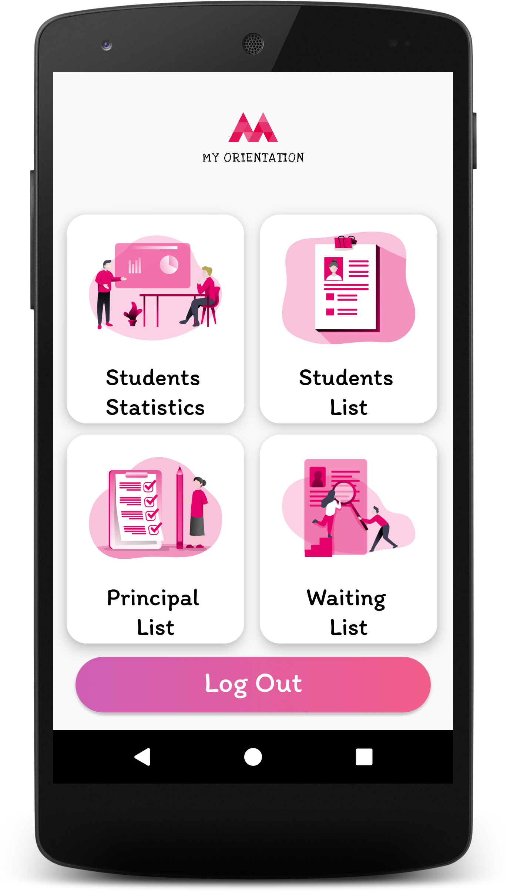
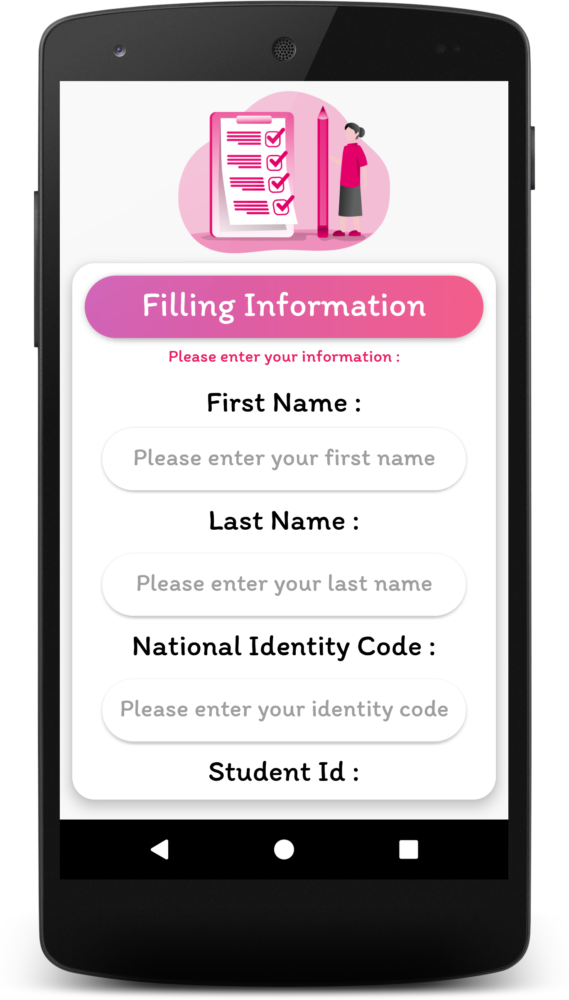
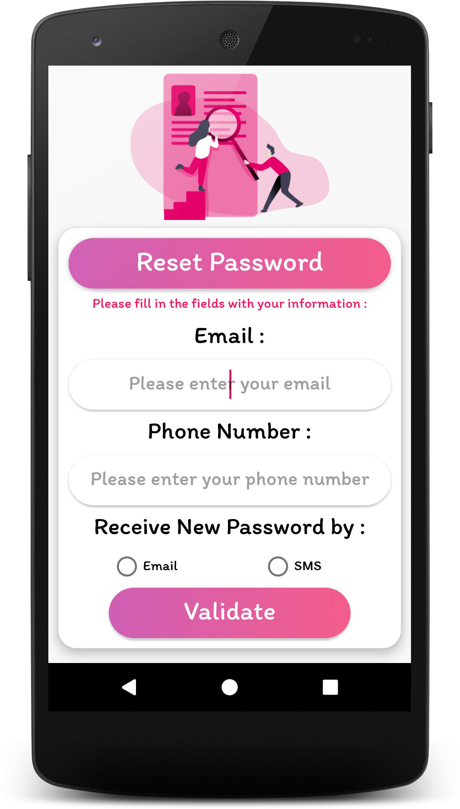

# MyOrientation
> An Android application that makes it easier for students to enroll in universities


## Built With
* [itextpdf](https://itextpdf.com/en)
* [MPAndroidChart](https://github.com/PhilJay/MPAndroidChart)
* [CSnackbar](https://github.com/ChathuraHettiarachchi/CSnackBar)
* [jsoup](https://jsoup.org)
* [Oracle Database 12C](https://www.oracle.com/database/12c-database)
* [Nexmo](https://www.vonage.com/communications-apis)

## Features
- The student can easily log in to the application
- The student fills in their information and then generates the receipt as a PDF file
- The administrator has a dashboard from which he can generate the list of students for each specialty
- The administrator can also view charts of student statistics

## Prerequisites

- Install Android Studio :
> From : [Android Studio](https://developer.android.com/studio)

- Install Oracle Database 12C :
> Using [Docker](https://www.docker.com) :
```shell
docker pull truevoly/oracle-12c
mkdir ~/oracle_data
docker run -d -p 8080:8080 -p 1521:1521 -v ~/oracle_data/:/u01/app/oracle truevoly/oracle-12c
docker ps
```

- Edit settings.xml file :

```xml
<resources>
    <string name="database_server_ip">172.20.10.2</string>
    <string name="database_server_port">1521</string>
    <string name="database_user">system</string>
    <string name="database_password">oracle</string>
    <string name="email">email@gmail.com</string>
    <string name="password">password</string>
    <string name="nexmo_api_key">key</string>
    <string name="nexmo_api_secret">secret</string>
</resources>
```

## Screenshots
> Splash Screen :

> Log In :

> Admin Dashboard :

> Filling Information :

> Reset Password :



## Contributing

Contributions are what make the open source community such an amazing place to be learn, inspire, and create. Any contributions you make are **greatly appreciated**.

1. Fork the Project
2. Create your Feature Branch (`git checkout -b feature/AmazingFeature`)
3. Commit your Changes (`git commit -m 'Add some AmazingFeature'`)
4. Push to the Branch (`git push origin feature/AmazingFeature`)
5. Open a Pull Request

## License
[MIT License](https://choosealicense.com/licenses/mit/)


## Contact
- Imane Lahlou - [imanelahlou2000@gmail.com](mailto:imanelahlou2000@gmail.com)
- Khaoula El Majni - [elmajnikhaoula99@gmail.com](mailto:elmajnikhaoula99@gmail.com)
- Yassine Lafryhi - [y.lafryhi@gmail.com](mailto:y.lafryhi@gmail.com)
- Project Link : [https://github.com/Yassine-Lafryhi/MyOrientation](https://github.com/Yassine-Lafryhi/MyOrientation)
